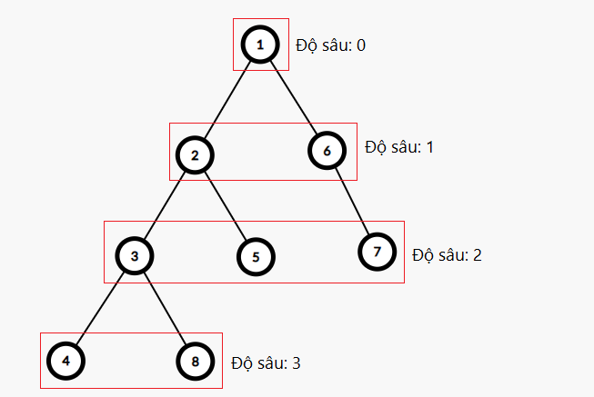
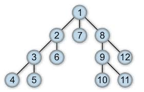

1. BFS là gì?
    - BFS (Breadth-First Search) là một thuật toán tìm kiếm theo chiều rộng, được sử dụng để duyệt hoặc tìm kiếm trong một cấu trúc dữ liệu như cây hoặc đồ thị. Thuật toán này bắt đầu từ một nút gốc và khám phá tất cả các nút con của nó trước khi chuyển sang các nút ở cấp độ tiếp theo.
   
    
   
3. DFS là gì?
    - DFS (Depth-First Search) là một thuật toán tìm kiếm theo chiều sâu, được sử dụng để duyệt hoặc tìm kiếm trong một cấu trúc dữ liệu như cây hoặc đồ thị. Thuật toán này bắt đầu từ một nút gốc và khám phá càng sâu càng tốt trước khi quay lại và khám phá các nút khác.

     
   
5. So sánh BFS và DFS:
    - BFS sử dụng hàng đợi (queue) để lưu trữ các nút cần khám phá, trong khi DFS sử dụng ngăn xếp (stack) hoặc đệ quy.
    - BFS khám phá tất cả các nút ở cùng một cấp độ trước khi chuyển sang cấp độ tiếp theo, trong khi DFS khám phá càng sâu càng tốt trước khi quay lại.
    - BFS thường được sử dụng để tìm đường đi ngắn nhất trong đồ thị không trọng số, trong khi DFS có thể được sử dụng để kiểm tra tính liên thông hoặc tìm kiếm tất cả các đường đi.
    - BFS có thể tiêu tốn nhiều bộ nhớ hơn so với DFS nếu đồ thị có nhiều nút ở cùng một cấp độ, trong khi DFS có thể tiêu tốn nhiều bộ nhớ hơn nếu đồ thị có nhiều nút ở cùng một đường đi sâu.
6. Ứng dụng của BFS và DFS: 
    - BFS được sử dụng trong các ứng dụng như tìm đường đi ngắn nhất, kiểm tra tính liên thông của đồ thị, và giải quyết các bài toán liên quan đến cây.

    - DFS được sử dụng trong các ứng dụng như kiểm tra tính liên thông của đồ thị, tìm kiếm tất cả các đường đi, và giải quyết các bài toán liên quan đến cây.
