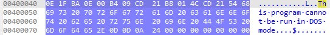
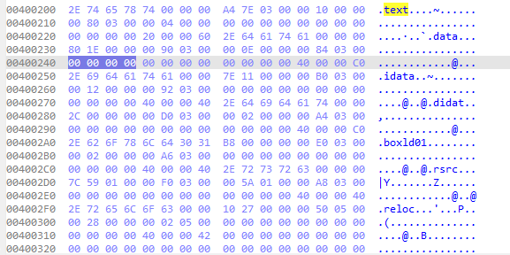

1. Cấu trúc Header trong PE file:
    - PE file có nhiều loại header khác nhau, bao gồm:
        - DOS Header: Đây là phần đầu tiên của PE file, chứa thông tin về định dạng tệp tin và địa chỉ của phần tiếp theo. DOS Header có kích thước cố định là 64 bytes và bắt đầu bằng chữ "MZ" (0x4D5A).
        - DOS Stub: Đây là phần tiếp theo sau DOS Header, chứa mã máy để hiển thị thông báo lỗi nếu tệp tin không được chạy trên hệ điều hành Windows. DOS Stub có kích thước thay đổi và thường chứa một thông điệp đơn giản như "This program cannot be run in DOS mode."
        - PE Header: Đây là phần tiếp theo sau DOS Header, chứa thông tin về cấu trúc của PE file, bao gồm số lượng section, kích thước của các section, và các thông tin khác liên quan đến chương trình. PE Header bắt đầu bằng chữ "PE" (0x5045).
        - Optional Header: Đây là phần mở rộng của PE Header, chứa thông tin chi tiết về chương trình, bao gồm địa chỉ entry point, kích thước stack, và các thông tin khác liên quan đến quá trình thực thi của chương trình.
2. MZ-DOS Header:
    - MZ-DOS Header là phần đầu tiên của PE file, chứa thông tin về định dạng tệp tin và địa chỉ của phần tiếp theo. MZ-DOS Header có kích thước cố định là 64 bytes và bắt đầu bằng chữ "MZ" (0x4D5A). MZ-DOS Header cũng chứa một trường gọi là "e_lfanew", cho biết địa chỉ của PE Header trong tệp tin.
   
    
3. DOS Stub:
    - DOS Stub là phần tiếp theo sau DOS Header, chứa mã máy để hiển thị thông báo lỗi nếu tệp tin không được chạy trên hệ điều hành Windows. DOS Stub có kích thước thay đổi và thường chứa một thông điệp đơn giản như "This program cannot be run in DOS mode." Mục đích của DOS Stub là đảm bảo rằng nếu người dùng cố gắng chạy tệp tin trên một hệ điều hành không hỗ trợ PE file, họ sẽ nhận được một thông báo lỗi thay vì gặp sự cố hoặc lỗi không rõ ràng.
   
    
4. PE Header:
    - PE Header là phần tiếp theo sau DOS Header, chứa thông tin về cấu trúc của PE file, bao gồm số lượng section, kích thước của các section, và các thông tin khác liên quan đến chương trình. PE Header bắt đầu bằng chữ "PE" (0x5045) và có kích thước cố định là 24 bytes. PE Header cũng chứa một trường gọi là "NumberOfSections", cho biết số lượng section trong PE file.
    - Các trường trong PE Header bao gồm:
        - Signature: Chữ "PE" (0x5045) để xác định rằng đây là một PE file.
       
        
        - Machine: Loại kiến trúc máy tính mà chương trình được thiết kế để chạy trên đó (ví dụ: x86, x64).
      
        
            Ví dụ ở đây là kiến trúc x86 (0x14C). Nếu là x64 thì giá trị sẽ là 0x8664 hay 86 64.
        - NumberOfSections: Số lượng section trong PE file.
      
        
            - Các Section trong PE file có thể chứa mã máy, dữ liệu, hoặc tài nguyên khác. Số lượng section được lưu trữ trong trường này sẽ giúp hệ điều hành biết được có bao nhiêu section cần phải xử lý khi tải chương trình vào bộ nhớ.
        - TimeDateStamp: Thời gian tạo tệp tin, được lưu dưới dạng số nguyên đại diện cho số giây kể từ ngày 1 tháng 1 năm 1970.
        - PointerToSymbolTable: Địa chỉ của bảng symbol trong tệp tin (thường không sử dụng trong PE file).
        - NumberOfSymbols: Số lượng symbol trong bảng symbol (thường không sử dụng trong PE file).
        - SizeOfOptionalHeader: Kích thước của Optional Header.
        - Characteristics: Các đặc điểm của tệp tin, như khả năng thực thi, khả năng tải vào bộ nhớ, v.v.
5. Optional Header:
    - Optional Header là phần mở rộng của PE Header, chứa thông tin chi tiết về chương trình, bao gồm địa chỉ entry point, kích thước stack, và các thông tin khác liên quan đến quá trình thực thi của chương trình. Optional Header có kích thước thay đổi tùy thuộc vào kiến trúc máy tính mà chương trình được thiết kế để chạy trên đó (ví dụ: x86 hoặc x64).
    - Các trường trong Optional Header bao gồm:
        - Magic: Giá trị xác định loại Optional Header (ví dụ: 0x10B cho x86, 0x20B cho x64).
        - MajorLinkerVersion: Phiên bản chính của linker được sử dụng để tạo tệp tin.
        - MinorLinkerVersion: Phiên bản phụ của linker được sử dụng để tạo tệp tin.
        - SizeOfCode: Kích thước của phần mã máy trong PE file.
        - SizeOfInitializedData: Kích thước của phần dữ liệu đã khởi tạo trong PE file.
        - SizeOfUninitializedData: Kích thước của phần dữ liệu chưa khởi tạo trong PE file.
        - AddressOfEntryPoint: Địa chỉ entry point của chương trình, nơi quá trình thực thi bắt đầu.
        - BaseOfCode: Địa chỉ cơ sở của phần mã máy trong PE file.
        - BaseOfData: Địa chỉ cơ sở của phần dữ liệu trong PE file (chỉ có trong Optional Header cho x86).
        - ImageBase: Địa chỉ cơ sở mà chương trình sẽ được tải vào bộ nhớ khi chạy.
        - SectionAlignment: Căn chỉnh của các section trong bộ nhớ khi chương trình chạy.
        - FileAlignment: Căn chỉnh của các section trong tệp tin khi lưu trữ trên đĩa.

    - Tuỳ theo kiến trúc x86 hay x64 mà Optional Header sẽ có các trường khác nhau, ví dụ như BaseOfData chỉ xuất hiện trong Optional Header cho x86, trong khi đó không có trong Optional Header cho x64. Optional Header cung cấp thông tin quan trọng để hệ điều hành có thể tải và thực thi chương trình một cách chính xác. Ngoài ra, kiểu dữ liệu trường trong đây cũng khác nhau, ví dụ như DWORD (4 bytes) cho x86 và QWORD (8 bytes) cho x64.
