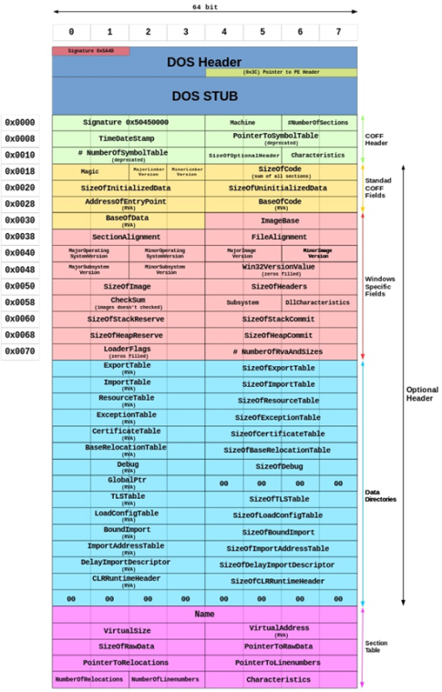

1. PE File là gì?
    - PE (Portable Executable) là một định dạng tệp tin được sử dụng trong hệ điều hành Windows để lưu trữ các chương trình thực thi, thư viện động (DLL), và các tệp tin khác liên quan đến phần mềm. PE file chứa thông tin về cấu trúc của chương trình, bao gồm mã máy, dữ liệu, và các tài nguyên cần thiết để chạy chương trình trên hệ thống Windows.
2. Cấu trúc của PE File:
    
    - PE file được chia thành nhiều phần, bao gồm:
        - DOS Header: Phần đầu tiên của PE file, chứa thông tin về định dạng tệp tin và địa chỉ của phần tiếp theo.
        - PE Header: Chứa thông tin về cấu trúc của PE file, bao gồm số lượng section, kích thước của các section, và các thông tin khác liên quan đến chương trình.
        - Section Table: Liệt kê các section trong PE file, mỗi section chứa mã máy, dữ liệu, hoặc tài nguyên khác.
        - Sections: Các phần chứa mã máy, dữ liệu, hoặc tài nguyên cần thiết để chạy chương trình.

