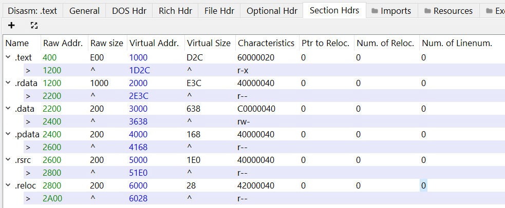
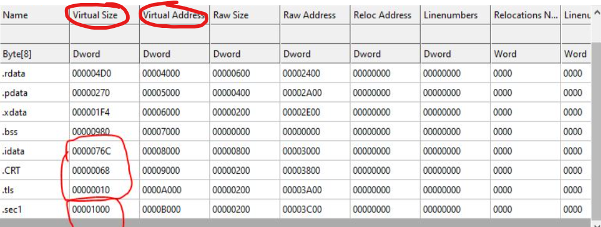

1. Section Table trong file PE:
    - Section Table là một phần quan trọng trong PE file, chứa thông tin về các section trong tệp tin. Mỗi entry trong Section Table đại diện cho một section và chứa các trường như tên section, kích thước của section, địa chỉ của section trong tệp tin, và địa chỉ của section khi được tải vào bộ nhớ.
    - Các trường trong Section Table bao gồm:
        - Name: Tên của section, thường là một chuỗi ký tự ngắn (ví dụ: .text, .data, .rdata).
        - VirtualSize: Kích thước của section khi được tải vào bộ nhớ.
        - VirtualAddress: Địa chỉ của section khi được tải vào bộ nhớ.
        - SizeOfRawData: Kích thước của section trong tệp tin.
        - PointerToRawData: Địa chỉ của section trong tệp tin.
        - Characteristics: Các đặc điểm của section, như khả năng thực thi, khả năng đọc/ghi, v.v.
2. Trường Name trong Section Table:
    - Trường Name trong Section Table chứa tên của section, thường là một chuỗi ký tự ngắn (ví dụ: .text, .data, .rdata). Tên của section giúp xác định loại dữ liệu hoặc mã máy mà section chứa. Ví dụ, section có tên ".text" thường chứa mã máy thực thi, trong khi section có tên ".data" thường chứa dữ liệu đã khởi tạo.
    
3. Trường VirtualSize và VirtualAddress trong Section Table:
    - Trường VirtualSize trong Section Table cho biết kích thước của section khi được tải vào bộ nhớ. Trường VirtualAddress cho biết địa chỉ của section khi được tải vào bộ nhớ. Khi chương trình được tải vào bộ nhớ, hệ điều hành sẽ sử dụng thông tin này để xác định vị trí và kích thước của section trong bộ nhớ, từ đó có thể truy cập và thực thi mã máy hoặc dữ liệu trong section một cách chính xác.
    
4. Trường SizeOfRawData và PointerToRawData trong Section Table:
    - Trường SizeOfRawData trong Section Table cho biết kích thước của section trong tệp tin, trong khi trường PointerToRawData cho biết địa chỉ của section trong tệp tin. Khi hệ điều hành tải chương trình vào bộ nhớ, nó sẽ sử dụng thông tin này để đọc dữ liệu từ tệp tin và sao chép nó vào bộ nhớ tại vị trí được xác định bởi VirtualAddress. Điều này đảm bảo rằng mã máy và dữ liệu trong section được tải chính xác từ tệp tin vào bộ nhớ để chương trình có thể thực thi một cách hiệu quả.
5. Trường Characteristics trong Section Table:
    - Trường Characteristics trong Section Table chứa các đặc điểm của section, như khả năng thực thi, khả năng đọc/ghi, v.v. Các đặc điểm này được biểu diễn dưới dạng các bit flags, cho phép hệ điều hành biết được cách xử lý section khi tải chương trình vào bộ nhớ. Ví dụ, nếu một section có đặc điểm là "executable" (có thể thực thi), hệ điều hành sẽ cho phép mã máy trong section đó được thực thi khi chương trình chạy. Nếu một section có đặc điểm là "readable" (có thể đọc), hệ điều hành sẽ cho phép truy cập dữ liệu trong section đó. Các đặc điểm này rất quan trọng để đảm bảo rằng chương trình hoạt động đúng cách và an toàn khi chạy trên hệ thống Windows.
6. Các Section:
    - .text hay .code: Đây là section chứa mã máy thực thi của chương trình. Section này thường có đặc điểm là "executable" (có thể thực thi) và "readable" (có thể đọc), nhưng không có đặc điểm "writable" (có thể ghi). Mã máy trong section .text sẽ được thực thi khi chương trình chạy.
    - .data: Đây là section chứa dữ liệu đã khởi tạo của chương trình.
    - .rdata: Đây là section chứa dữ liệu chỉ đọc của chương trình, như chuỗi ký tự, hằng số, v.v. Section này thường có đặc điểm là "readable" (có thể đọc) nhưng không có đặc điểm "executable" (có thể thực thi) hoặc "writable" (có thể ghi). Dữ liệu trong section .rdata sẽ được sử dụng bởi chương trình nhưng không thể bị thay đổi trong quá trình thực thi.
    - .bss: Đây là section chứa dữ liệu chưa khởi tạo của chương trình. Section này thường có đặc điểm là "writable" (có thể ghi) nhưng không có đặc điểm "executable" (có thể thực thi) hoặc "readable" (có thể đọc). Dữ liệu trong section .bss sẽ được khởi tạo bằng giá trị 0 khi chương trình chạy.
    - .rsrc: Đây là section chứa tài nguyên của chương trình, như biểu tượng (icons), menu, dialog, v.v. Section này thường có đặc điểm là "readable" (có thể đọc) nhưng không có đặc điểm "executable" (có thể thực thi) hoặc "writable" (có thể ghi). Tài nguyên trong section .rsrc sẽ được sử dụng bởi chương trình để hiển thị giao diện người dùng hoặc cung cấp các chức năng khác liên quan đến tài nguyên.