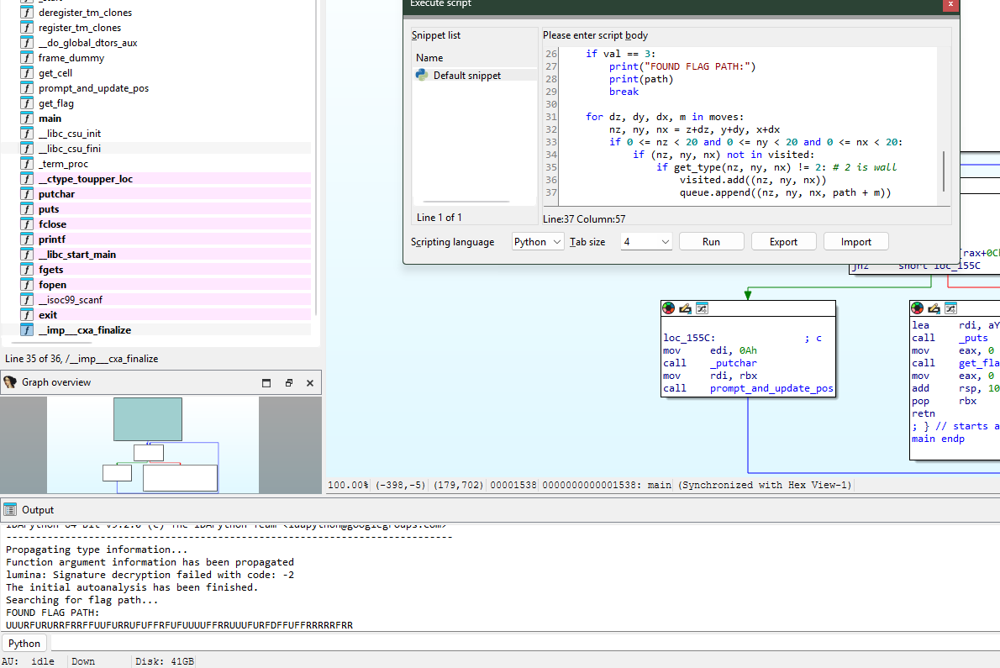

1. Tunnel
    - Từ code của bài, ta thấy được chương trình sẽ thực hiện:
        - 1. Tạo một ma trận
        - Xem người dùng di chuyển trong ma trận có tới giá trị 3 hay tường không
            - Nếu là giá trị 3 thì trả cờ
            - Nếu là tường thì yêu cầu đi lại
    - Cách giải:
        - Patch code này vào IDA:
```
import idc
import ida_bytes

# Cập nhật địa chỉ của biến maze tại đây
# Ví dụ: MAZE_ADDR = 0x602080 
# Bạn có thể tìm bằng cách nhấn 'g' rồi gõ tên biến 'maze' trong IDA
MAZE_ADDR = idc.get_name_ea_simple("maze") 

def get_type(z, y, x):
    offset = (6400 * z) + (320 * y) + (16 * x)
    # Đọc 4 byte tại MAZE_ADDR + offset + 12
    return ida_bytes.get_dword(MAZE_ADDR + offset + 12)

queue = [(0, 0, 0, "")]
visited = {(0, 0, 0)}

moves = [(-1, 0, 0, 'L'), (1, 0, 0, 'R'), (0, -1, 0, 'B'), 
         (0, 1, 0, 'F'), (0, 0, -1, 'D'), (0, 0, 1, 'U')]

print("Searching for flag path...")

while queue:
    z, y, x, path = queue.pop(0)
    
    val = get_type(z, y, x)
    if val == 3:
        print("FOUND FLAG PATH:")
        print(path)
        break
        
    for dz, dy, dx, m in moves:
        nz, ny, nx = z+dz, y+dy, x+dx
        if 0 <= nz < 20 and 0 <= ny < 20 and 0 <= nx < 20:
            if (nz, ny, nx) not in visited:
                if get_type(nz, ny, nx) != 2: # 2 is wall
                    visited.add((nz, ny, nx))
                    queue.append((nz, ny, nx, path + m))
```



Chạy code ta thu được các nước giải: UUURFURURRFRRFFUUFURRUFUFFRFUFUUUUFFRRUUUFURFDFFUFFRRRRRFRR

Sử dụng lệnh sau với máy linux và thu cờ: echo -n "UUURFURURRFRRFFUUFURRUFUFFRFUFUUUUFFRRUUUFURFDFFUFFRRRRRFRR" | ./ten_chuong_trinh